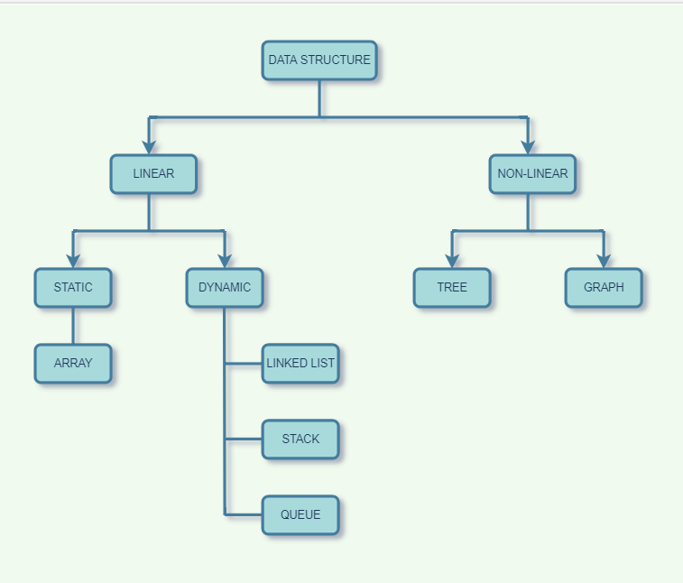

# DATA STRUCTURES

This repository is meant to study and practice the implementation of different data structures with Java.

### Types of Data Structures in Java

* Array
* Linked List
* Stack 
* Queue
* Binary Tree
* Binary Search Tree
* Heap
* Hashing 
* Graph

**Here is the pictorial representation of types of java data structures**

